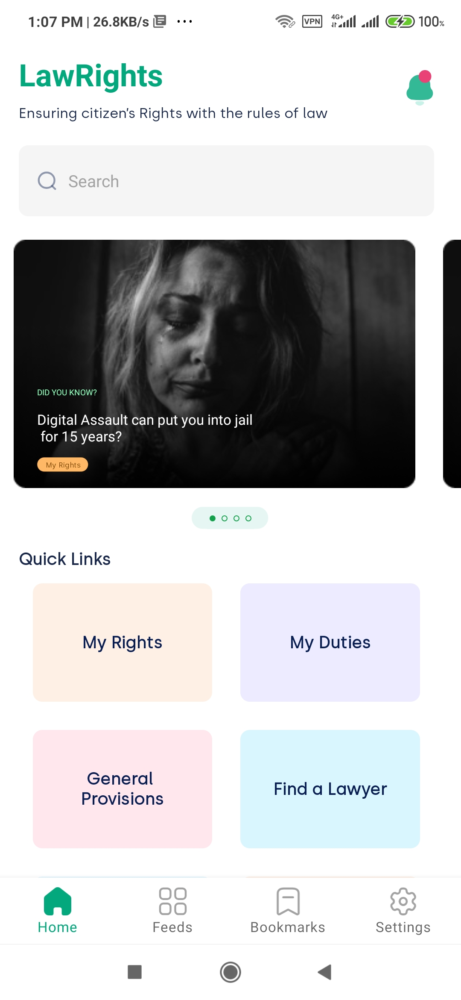
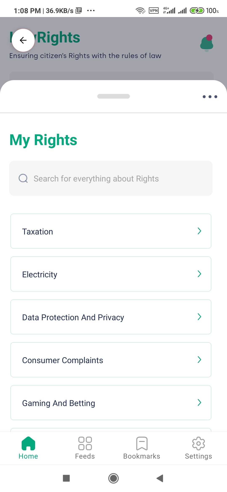

# LawRights

Android app for interview test. App features:
 * Kotlin
 * MVVM
 * Unit tests
 * Dependency Injection (Hilt)
 * Offline caching
 * Coroutines
 
## Thought process and architectural decisions
For the app, I decided to use a single module application with hilt, mostly bcause of the simplicity of the application. Nevertheless, using DI with hilt, the apps components remain totally seperated.

MVVVM architecture was used because of it's ease of use and understanding. Added the repository as a single source of thruth for calls from the viewModel.

Offline caching is done by fetching from the remote endpoint and saving into the local database. 

Custom UI design was done with the standard bottomsheet rather than the modal bottomsheet to allow use of custom back button and also show bottom naviagtions. Offsets were calculated for the viewpager and the bottom quick links were made with a Recyclerview and a GridLayout manager where the span size is automatically calculated.

## How the App works
Since there was no login screen provided, when the user opens the app, a request is authomatically sent in to log him/her in. After that, the auth token is then fetched and saved with the SessionManager. 

This ath token is then used to fetch data from the endpoint. When the data is fetched, it is automatically saved into the apps DB. On subsequent opening of the app, lack of internet will not affect the exerince because the data save in the Db will then be used.

The Auth token expires in 10m so it is possible that a 401 is thrown when the fetch is called. In this event may occur, a custom exception handler was setup to hadle it. The app automatically logs in the user again, saves the token and then fetches the data. 

 

  
   &nbsp; &nbsp; &nbsp;
  
   &nbsp; &nbsp; &nbsp;
  
   &nbsp; &nbsp; &nbsp;

